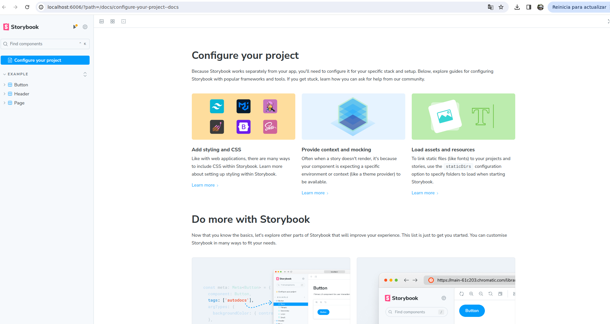
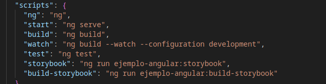

# Creación con Angular

- Crear proyecto libreria Angular `ng new ejemplo-angular --create-application=false`
- Para generar la librería `ng g libray ejemplo-angular` (La genera en `projects/ejemplo-angular`)
- Inicializar proyecto `StoryBook` `npx sb init`
- Usar `Compodoc`
- Arrancará `StoryBook` en `http://localhost:6006`

- Habrá creado una carpeta llamada `.storybook` con la configuración que cargará en `StoryBook`

- Para ejecutarlo manualmente , habrá creado un `Script` en `package.json` llamado `storybook`

